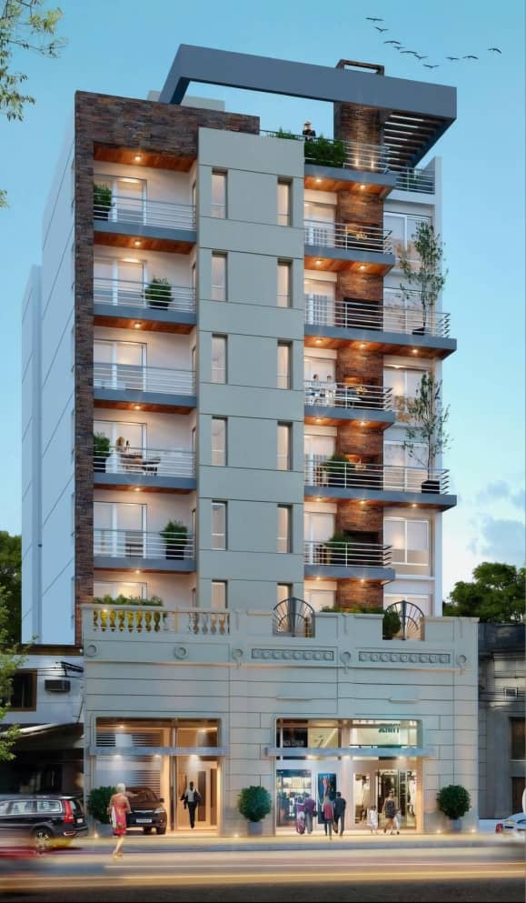
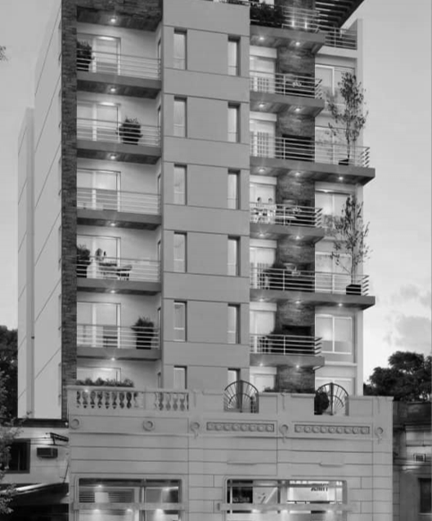
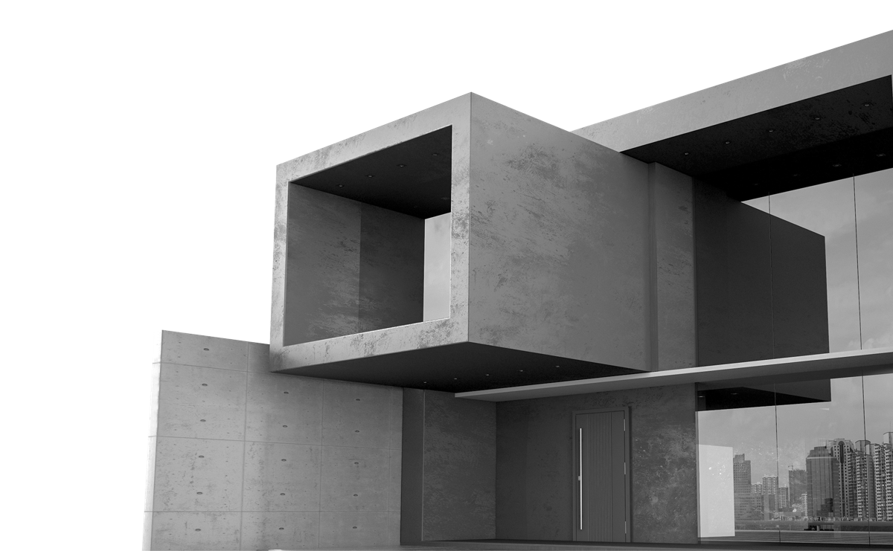

# UKUEM Investment Complex  
### Donor Proposal  
<!--  -->

---

# Introduction

- UKUEM Investment Complex is proposed to serve as the dedicated headquarter for UKUEM in Mombasa.  
- It is designed as a mixed-use facility integrating administrative offices with commercial and residential spaces.  
- This facility will both house UKUEM operations and generate revenue through leasing.

<!--  -->

---

# Why It’s Matter?

- **Donor Contributions:** Enable establishment of a permanent headquarter for UKUEM.
- **Functional Facility:** Meets the need for a mixed-use facility in Mombasa.
- **Sustainable Revenue:** Provides a self-sustaining source of income for ongoing NGO activities.

<!--  -->
<!--  -->

---

# The Objectives

- ### Construct a dedicated headquarter for UKUEM in Mombasa.  
- ### Develop a mixed-use facility that generates revenue through leasing.  
- ### Meet both administrative needs and market demand.

---

<!-- _class: lead -->
<!-- _color: white -->

# Building Configuration

---

|              |                                                              |
| :----------- | :----------------------------------------------------------- |
| Basement     | Two staircases, two elevator shafts, and parking facilities. |
| Ground Floor | Up to 12 commercial spaces.                                  |
| First Floor  | 4 office units.                                              |
| Second Floor | 4 office units.                                              |
| Third Floor  | Multipurpose Hall.                                           |
| Fourth Floor | 4 apartment units (each with 3 bedrooms).                    |
| Fifth Floor  | 6 apartment units (each with 2 bedrooms).                    |

<!--  -->
<!--  -->

---

# Demand Analysis

- ## Market assessments confirm the need for a quality mixed-use facility in Mombasa.  
- ## The project addresses local demand for functional office, commercial, and residential spaces.

---

# Program Value

- ### Establishes a permanent headquarter for UKUEM.  
- ### Generates diversified income through leasing of commercial, office, and residential units.  
- ### Contributes to local economic and urban development.

---

# Advantages

- **Location:** Centrally located in Mombasa for easy accessibility.
- **Dual Function:** Serves as both the headquarter and an investment asset.
- **Revenue Diversification:** Multiple income streams reduce investment risk.

---

# Business Model & Sustainability

- Financed through donor contributions and investment partnerships.
- Revenue generated from leasing commercial, office, and residential spaces.
- Managed by a dedicated team to ensure long-term sustainability.

<!--  -->
<!--  -->

---

# Social & Economic Impact

- Creates employment during construction and operation.
- Enhances local infrastructure and urban development in Mombasa.
- Demonstrates a sustainable model combining NGO operations with revenue generation.

<!--  -->

---

<!-- _class: lead -->
<!-- _color: white -->

# Financing Summary

---

### Revenue

| Facilities             | Quantity | Unit Market Price Monthly (USD) | Total |
| :--------------------- | -------: | ------------------------------: | ----: |
| Office Rooms           |       30 |                             100 | 3,000 |
| Apartment              |        8 |                             500 | 4,000 |
| Multi-purpose Hall     |        2 |             400 * 2 (frequency) | 1,600 |
| Terrace - Mobile Tower |        1 |                             500 |   500 |
| Penthouse              |        1 |                             300 |   300 |
| **Grand Total**        |          |                                 | 9,400 |

---

### Initial Costs

| Component                   | Estimation Value (USD) |
| --------------------------- | ---------------------- |
| Construction Cost (initial) | 1,500,000              |
| Interior and Furniture      | 520,000                |
| **Total Initial Costs**     | **2,200,000**          |

---

### Running Costs

| Component               | Estimation Value (USD) |
| ----------------------- | ---------------------- |
| Operation Cost          | 2,200                  |
| Taxes (15%)             | 1,050                  |
| **Total Running Costs** | **3,250**              |

<!--  -->

---

# Operation Plan

- **Basement:**  
  - Two staircases, two elevator shafts, and parking facilities.
- **Ground Floor:**  
  - Up to 12 commercial spaces.
- **First Floor:**  
  - 4 office units.
- **Second Floor:**  
  - 4 office units.
- **Third Floor:**  
  - Multipurpose Hall.
- **Fourth Floor:**  
  - 4 apartment units (each with 3 bedrooms).
- **Fifth Floor:**  
  - 6 apartment units (each with 2 bedrooms).

---

# Next Steps

- Secure donor funding and investment commitments.
- Finalize design details and financial planning.
- Proceed with detailed project planning and implementation.

---

# Thank You

Thank you for your consideration and support.

